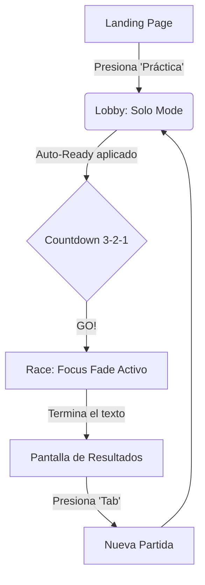
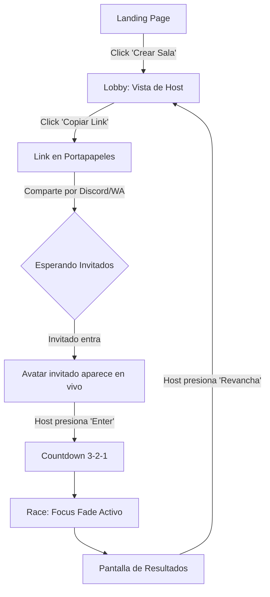
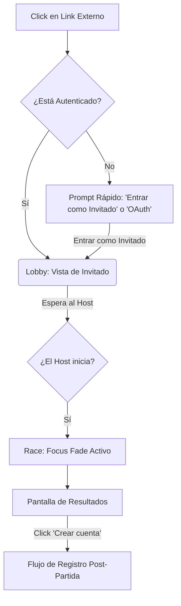

# UX Design Specification UltimaType

**Author:** Seba
**Date:** 2026-03-26

---

## Resumen Ejecutivo

### Visión del Proyecto
Crear la experiencia definitiva de competencia de mecanografía multijugador, guiada por la directiva "The Analog Velocity". Reemplaza los típicos dashboards rígidos por una experiencia "Táctil Digital" gracias al uso exclusivo de jerarquías tonales (sin bordes de 1px), tipografía a gran escala (Space Grotesk) y glassmorphism. UltimaType busca inducir un estado de "flow" de alto rendimiento en los jugadores mientras ofrece un espectáculo visceral para los espectadores.

### Usuarios Objetivo
- **Competidores Sociales:** Jóvenes/adultos que buscan interacciones ágiles y cargadas de adrenalina. Para ellos, los botones de acción ("Kinetic Triggers") y el uso focalizado del naranja eléctrico (#FF9B51) deben resultar irresistibles.
- **Retadores ("Grinders"):** Usuarios enfocados en superar métricas (WPM). Para ellos, la visualización `display-lg` (3.5rem) del contador WPM debe transmitir la energía pura de su progreso.
- **Espectadores:** Usuarios casuales donde recae gran valor de la estética general y las micro-interacciones de los cursores en movimiento fluido.

### Desafíos Principales de Diseño (Key Design Challenges)
- **Claridad Visual sin Líneas:** Estructurar las interfaces complejas (como la pantalla de resultados o el lobby) utilizando exclusivamente transiciones de fondo y espacios en blanco (`24` spacing token), respetando la estricta **"No-Line Rule"**.
- **Patrón "Focus Fade":** Implementar la transición inmersiva donde toda la UI se desvanece al 20% de opacidad exceptuando el área de tipeo y el WPM, de forma que el jugador no pierda la noción del estado general de la sala.
- **Fricción Cero en el Onboarding:** Diseñar el flujo de entrada e invitación para que tome menos de 3 clics, integrando los botones CTAs ricos en gradientes (`primary` a `primary-container`).

### Oportunidades de Diseño
- **Componentes "Kinetic":** Crear entradas de texto minimalistas (solo una línea inferior que se expande al hacer focus) y barras de progreso con forma de píldora que se integren directamente con la energía de la competencia.
- **Estética "Kinetic Monospace" (Dark Mode):** Utilizar paletas profundas (`#25343F` a `#0f1f29`) contrastadas por el naranja vibrante (`#FF9B51`) para lograr ese "High-End Editorial Atmosphere" único en hackathons.
- **Profundidad Atmosférica:** En lugar de sombras planas estándar (`rgba(0,0,0,0.5)`), usar sombras sutilmente teñidas de azul-gris (`rgba(15,31,41, 0.06)`) para un look ultra-premium.

## Core User Experience

### Defining Experience
La acción central y crítica es **teclear de forma precisa y rápida mientras se percibe la presión y el progreso de los oponentes en tiempo real**. Si logramos que la interacción del teclado se sienta táctil, fluida y que la respuesta visual de los cursores (Live Caret Sync) sea instantánea, todo lo demás en el producto fluirá.

### Platform Strategy
- **Plataforma Principal:** Navegadores Web de Escritorio (Desktop Web).
- **Interacción:** Exclusivamente teclado físico para la competencia, con interacciones mínimas de ratón para configuración de salas.
- **Requisito Técnico Crítico:** Conexiones WebSocket estables de latencia ultra baja (≤100ms) para garantizar la ilusión de presencia simultánea. Con respecto a dispositivos móviles (Mobile Web), estos quedarán limitados al rol exclusivo de "Espectador".

### Effortless Interactions
- **Invitación Cero Fricción:** Un usuario debe poder compartir un enlace (deep-link) y el receptor debe aterrizar en el lobby, autenticado (ej. OAuth rápido) y listo para jugar en menos de 3 clics o menos de 30 segundos.
- **Inmersión Inmediata:** La transición del Lobby a la partida ocurre de manera automática una vez que el host inicia. Todo fluye de un conteo de 3-2-1 al ocultamiento de la interfaz perimetral (Focus Fade) sin que los participantes necesiten realizar clics adicionales.

### Critical Success Moments
- **El Momento "Aha!":** Cuando los amigos entran al Lobby y ven inmediatamente cómo a cada uno se le asigna un avatar con un color vibrante de cursor (caret) distinto.
- **El Clímax del Duelo:** Los momentos finales de la partida, donde el jugador ve la persecución física de los cursores de sus amigos pisándole los talones.
- **La Descarga de Adrenalina Final:** La aparición inmediata de la Tipografía Monumental (`display-lg` de Space Grotesk) validando sus Palabras Por Minuto (WPM) tras dar el último golpe de teclado.

### Experience Principles
1. **La Velocidad Dicta el Diseño:** Elementos que responden visualmente a la rapidez de acción del usuario (Kinetic Triggers).
2. **Cero Fricción para Jugar:** El embudo de integración más corto posible entre visualizar la landing page y comenzar el duelo.
3. **Inmersión por Sustracción (Focus Fade):** Durante el centro de la experiencia (la carrera), suprimir todo el ruido visual perimetral para inducir hiper-concentración.
4. **Respuesta Táctil-Visceral:** Las animaciones e interfaces en pantalla deben sentirse como una extensión física y conectada directamente a las pulsaciones en el teclado macánico del usuario.

## Desired Emotional Response

### Primary Emotional Goals
- **Adrenalina y Urgencia:** El usuario debe sentir pura energía competitiva al ver los cursores (carets) de sus amigos avanzar en la misma pantalla.
- **Concentración Extrema (Flow):** Una sensación de inmersión total donde el mundo exterior desaparece mientras dure la competencia.
- **Orgullo y Satisfacción:** El sentimiento de logro al alcanzar un nuevo récord personal de WPM o ganar una carrera.
- **Conexión Social:** Sentirse parte de un grupo de amigos a través de la competencia sana y directa.

### Emotional Journey Mapping
- **Descubrimiento/Onboarding:** *Intriga y Sorpresa.* "Wow, esto luce como un producto premium, y entré a la sala sin ningún obstáculo."
- **Pre-Partida (Lobby):** *Anticipación.* Ver aparecer a los amigos, cada uno con un color vibrante distinto, elevando las expectativas antes del conteo.
- **Durante la Partida:** *Hiperfoco y Presión.* El mundo se apaga (Focus Fade). Solo existe el texto y la urgencia de no dejarse alcanzar por los otros cursores.
- **Post-Partida:** *Catarsis y Deseo de Revancha.* Al finalizar, una mezcla de alivio y la necesidad inmediata de decir "una vez más" para mejorar el puntaje.

### Micro-Emotions
- **Confianza vs. Pánico:** La seguridad de teclear una racha perfecta versus el pánico visceral de cometer un error y ver de reojo cómo un cursor enemigo te supera.
- **Deleite Táctil:** El placer visual que produce la respuesta inmediata del cursor naranja (`#FF9B51`) acompañando perfectamente cada golpe de tecla.
- **Pertenencia:** La familiaridad de compartir una "sala privada" que se siente exclusiva gracias a los avatares y colores únicos.

### Design Implications
- **Para generar Adrenalina:** Utilizar el tamaño tipográfico masivo (`display-lg` a 3.5rem) para el contador WPM en tiempo real, de manera que el usuario sienta "el peso" de su velocidad.
- **Para inducir el Flow:** Implementar la regla estricta de "Sin Líneas" (No-Line Rule) y el "Focus Fade", eliminando bordes discordantes y atenuando toda la UI al 20% para anular distracciones.
- **Para mitigar la Frustración de un Error:** Manejar el estado de error de forma que sea inconfundible pero rápido de corregir, sin romper por completo el ritmo editorial de la interfaz.

### Emotional Design Principles
1. **La Estética amplifica la Competencia:** Todo elemento visual, desde el glassmorphism hasta el gradiente sutil de un botón, debe transmitir que esto no es solo "practicar", es "competir profesionalmente".
2. **El Estrés es Positivo (Eustrés):** Diseñar para que la presión de ver otros cursores se sienta emocionante y no paralizante.
3. **Recompensa Inmediata:** El feedback visual y los números grandes y legibles (Space Grotesk) deben validar instantáneamente el esfuerzo del jugador.

## UX Pattern Analysis & Inspiration

### Inspiring Products Analysis
- **Monkeytype:** El estándar de oro en mecanografía en solitario. Su éxito radica en su minimalismo extremo, opciones de personalización y ausencia de distracciones. Demuestra que los usuarios valoran las interfaces limpias y de aspecto profesional.
- **Figma:** Referente absoluto en *Live Presence*. El uso de cursores coloridos con el nombre flotando transmite una sensación inmediata de espacio compartido y trabajo simultáneo.
- **Linear / Vercel:** Referentes en diseño "High-End Editorial" y herramientas para power-users. Navegación centrada en el teclado, uso magistral del espacio en blanco, y jerarquías tonales en lugar de bordes marcados.
- **TypeRacer (Anti-Referente):** Funcionalmente excelente pero visualmente estancado. Separa la vista de la "carrera" (barras de progreso) del texto real que se lee, dividiendo la atención del jugador.

### Transferable UX Patterns
- **Presencia en Vivo (Figma-style):** Cursores coloreados asignados a cada jugador moviéndose en tiempo real por el bloque de texto (Live Caret Sync).
- **Keyboard-First Navigation (Linear-style):** Manejo completo de la app mediante el teclado.
- **Sustracción Dinámica (iA Writer-style):** Desvanecer periféricos suavemente al detectar actividad de tipeo (Focus Fade).
- **Tonal Layering (Vercel-style):** Agrupar contenido utilizando cambios de color de fondo en lugar de líneas rígidas.

### Anti-Patterns to Avoid
- **Progreso Desconectado del Texto:** Representar el progreso en una sección separada (ej. barra superior) dividiendo la atención focal del usuario.
- **Onboarding Interrumpido:** Exigir configuración exhaustiva antes de la primera partida. OAuth de un clic directo al lobby.
- **UI Enjaulada:** Uso de recuadros de borde grueso (`1px solid`) para delimitar áreas, afectando el aspecto premium.

### Design Inspiration Strategy
- **Adopciones Directas:** El minimalismo central de Monkeytype, combinado con los cursores vivos estilo Figma.
- **Adaptaciones Críticas:** Nuestro "Focus Fade" no ocultará todo el texto (solo la UI), manteniendo visible el WPM titánico y reduciendo los comandos periféricos al mínimo.
- **Líneas Rojas:** Estrictamente prohibida la división de la lectura y la carrera en dos segmentos visuales distintos en la pantalla de competencia.

## Design System Foundation

### 1.1 Design System Choice
**Custom Design System sobre Primitivas "Headless" (ej. Tailwind CSS + Radix UI o shadcn/ui modificado)**
En lugar de utilizar un sistema de componentes ya estilizado, construiremos nuestro propio sistema visual utilizando clases de utilidad (Tailwind) y lógica no visual (Headless UI) para garantizar accesibilidad sin comprometer la estética.

### Rationale for Selection
- **Control Estético Absoluto:** Nuestra regla "No-Line" y la necesidad de sombras tintadas (`rgba(15,31,41, 0.06)`) requieren un lienzo en blanco. Los sistemas establecidos imponen bordes y sombras genéricas que arruinarían el estilo "High-End Editorial".
- **Rendimiento para la Velocidad:** Necesitamos que la app sea extremadamente ágil para que el "Live Caret Sync" fluya. Las librerías *headless* envían menos código innecesario al cliente.
- **Keyboard-First por Defecto:** Al usar primitivas como Radix, aseguramos que la navegación por teclado funcione a la perfección desde el primer día.

### Implementation Approach
- **Motor de Estilos:** Tailwind CSS, configurado estrictamente para no permitir colores fuera de la paleta definida (Dark mode base: `#25343F` a `#0f1f29`, Acento: `#FF9B51`).
- **Componentes Complejos:** Uso de primitivas no estilizadas (modales, tooltips) inyectando nuestra estética "Kinetic Monospace" directamente en ellos.
- **Tipografía Base:** Configurar globalmente `Space Grotesk` como la fuente principal, con tipografías monoespaciadas reservadas estrictamente para bloques de código si la prueba lo requiere.

### Customization Strategy
- **Tonal Layering System:** Extender los colores de fondo en Tailwind para incluir variables semánticas como `bg-surface-sunken`, `bg-surface-base`, y `bg-surface-raised`.
- **Desactivación de Bordes:** Eliminar los estilos de borde base globalmente para obligarnos a diseñar mediante contrastes tonales.
- **Clases de Animación Nativas:** Crear utilidades para el `focus-fade-in` y `focus-fade-out`, así como animaciones elásticas (spring) para los cursores multijugador.

## 2. Core User Experience

### 2.1 Defining Experience
La experiencia que define a UltimaType es el **"Live Caret Sync" (Sincronización de Cursores en Vivo)** combinado con un **Sistema de Puntuación de Precisión-Velocidad**. A diferencia de un test de mecanografía tradicional, el usuario percibe el bloque de texto como un espacio físico compartido donde compite en tiempo real viendo los cursores de sus oponentes, manejando el equilibrio entre teclear rápido y corregir errores.

### 2.2 User Mental Model
- **Mecanografía como Lienzo Multijugador:** Los usuarios traen el modelo colaborativo de herramientas como Figma, donde ver el cursor significa presencia real.
- **Riesgo vs. Recompensa (Velocidad vs. Precisión):** El usuario sabe que puede ignorar un error y seguir avanzando para mantener su WPM alto, pero sacrificando precisión, lo que impactará fuertemente en su Puntuación Final.

### 2.3 Success Criteria
- **Transición Táctil:** El paso del estado de espera (texto borroso) a la acción (visión clara y Focus Fade) debe sentirse como soltar el freno en una línea de salida.
- **Latencia Imperceptible:** El movimiento de los cursores enemigos debe fluir suavemente (spring physics) bajo los 100ms.
- **Claridad Focal:** El usuario distingue instantáneamente su propio cursor de los oponentes.
- **Feedback de Error Claro:** Las letras erróneas se pintan de rojizo y las correctas de verde, dejando un rastro visual inconfundible del desempeño.

### 2.4 Novel UX Patterns
- **Texto con Blur Inicial:** Revelar el texto eliminando un filtro de *blur* en el momento exacto del "GO!" añade anticipación dramática y evita que los jugadores lean por adelantado.
- **Tolerancia Continua de Errores:** En lugar de bloquear el avance del cursor ante un error, permitimos continuar. El usuario debe decidir dinámicamente si le conviene usar *Backspace* para retroceder, corregir e incrementar la precisión, o seguir adelante a expensas de un multiplicador penalizador en la fórmula final.

### 2.5 Experience Mechanics
1. **Initiation (El Arranque):** Al estar todos listos, inicia la cuenta regresiva 3-2-1. El texto principal está oculto visualmente con un efecto *blur*. En el "1", ocurre el *Focus Fade* (la UI exterior se atenúa) y simultáneamente se quita el *blur*, revelando el texto de forma clara y legible.
2. **Interaction (La Carrera):** El usuario teclea. Cada acierto pinta la letra de **verde** y avanza el cursor. Si hay un error, las letras erróneas se pintan de **rojizo**. El avance no se bloquea: el usuario sigue tecleando y los aciertos posteriores se pintan verdes, dejando los errores atrás. Si el usuario lo decide, puede usar *Backspace* para desmarcar el color de las letras, regresar al error y corregirlo (mejorando su precisión pero perdiendo velocidad).
3. **Feedback (La Presión y el Cálculo):** El sistema muestra y calcula constantemente:
   - **WPM:** Fórmula típica y estándar de palabras por minuto.
   - **Precisión:** Diferencia de aciertos, calculada como un factor decimal entre 0 y 1 (ej. 92% = 0.92). *Formula base referencial: (total - erróneas)/total*.
   - **Puntuación Final:** `WPM * 10 * Precisión`. (Ejemplo: 76.27 WPM * 10 * 0.92 = **701.68 puntos**).
4. **Completion (El Clímax):** Al concluir el texto, el *Focus Fade* termina, y se estampa el Puntuaje Final junto con el WPM y la Precisión, definiendo su lugar en la carrera frente a los oponentes.

## Visual Design Foundation

### Color System
Hemos adoptado una paleta **Dark Mode Nativa** que transmite una atmósfera "High-End Editorial".

**Brand & Semantic Colors:**
- **Primary / Brand (El Cursor):** Naranja Vibrante (`#FF9B51`). Un uso focal para el cursor del jugador local y acciones principales.
- **Success (Aciertos):** Verde Esmeralda/Menta (ej. `#4ADE80`), brillante y legible.
- **Error (Fallos):** Rojo Coral (ej. `#FB7185`), inconfundible al instante pero evitando fatiga visual excesiva.
- **Multiplayer Carets:** Una paleta suplementaria de colores neón (Cian, Magenta, Amarillo, etc.) dedicada a representar a los amigos.

**Tonal Layering (Fondos):**
- **Background Base (El Lienzo):** `#0F1F29`. Profundo y oscuro.
- **Surface Sunken (Paneles Secundarios):** `#1A2630`.
- **Surface Raised (Tarjetas/Flotantes):** `#25343F`. Elevación a través de tinte, prescindiendo de líneas perimetrales.
- **Text:** Blanco Roto (`#F8F9FA`) para el bloque de texto y legibilidad óptima, y Gris Pizarra (`#8B949E`) para elementos secundarios informativos.

### Typography System
- **Primary Typeface:** **Space Grotesk**. Una fuente sin serifa geométrica y técnica. Implementada globalmente.
- **Jerarquía Extrema:** Mayor énfasis en los datos dinámicos. Uso extenso de tamaños monumentales (`display-lg` a `text-7xl` a 4.5rem+) para métricas críticas como el WPM en vivo ("Focus Fade"), y un tamaño altamente legible y cómodo (`text-2xl`) para la pista de escritura, mitigando la fatiga del seguimiento ocular asimétrico.

### Spacing & Layout Foundation
- **Sistema Base:** Retícula basada en 8px (Tailwind standard).
- **Container Sizing (Legibilidad):** El bloque de texto estará limitado en ancho (aprox. `max-w-3xl`) garantizando líneas entre 65 y 75 caracteres de longitud ideal para la fluidez en lectura veloz.
- **La Regla del "No-Line":** La separación espacial dicta la estructura organizativa y las relaciones entre elementos. Los paneles del Lobby y Perfil de Usuario utilizarán saltos de color de superficie en vez de aplicar `border-width`.

### Accessibility Considerations
- **Contraste de Estados:** El texto a teclear y procesado mantiene un estricto contraste (WCAG AA) contra el lienzo base. El texto futuro, aunque atenuado (`opacity-60`), mantendrá integridad de silueta para escaneo visual.
- **Legibilidad Dinámica en Movimiento:** Al descartar las clásicas tipografías monoespaciadas "falsas" en favor de las proporciones de `Space Grotesk`, evitamos el tracking forzado de letras estrechas, logrando una textura de párrafo significativamente superior para lecturas veloces sostenidas.

## Design Direction Decision

### Design Directions Explored
1. **Asymetric Editorial:** Contador WPM masivo lateral con oponentes listados. Transmite alta competitividad pero el número constante cambiando resulta demasiado distractivo para el enfoque central.
2. **Zenith Centered:** Distribución arcade hiper-centrada. Funcional pero convencional.
3. **Absolute Minimalist:** Inmersión pura enfocada en el bloque de texto principal y los cursores, con toda la UI periférica atenuada o invisibilizada.

### Chosen Direction
**Absolute Minimalist** (con adaptaciones competitivas y soporte de temas Dual Clásico/Oscuro).
Se seleccionó la dirección minimalista por ser la que mejor encapsula la vibra "Kinetic Monospace". La prioridad absoluta y la jerarquía visual apuntan al bloque de texto central, evitando distracciones periféricas.

### Design Rationale
- **Concentración Intacta (Flow):** Un WPM masivo cambiando 10 veces por segundo rompe la concentración. Priorizar la dirección "Absolute Minimalist" asegura que el "Focus Fade" cumpla su función de túnel visual.
- **Competitividad Integrada:** La competencia no recae en leer un dashboard lejano, sino en la tensión visceral de ver el color del cursor oponente avanzar físicamente sobre el mismo texto que el usuario está leyendo.
- **Soporte Light/Dark Mode:** Es un requisito inquebrantable desde los bosquejos iniciales. La dirección de diseño dependiente de tipografía (en contraste con diseños llenos de cajas y fondos complejos) es mucho más elegante de transicionar entre variables de fondo oscuro y texto claro (y viceversa).

### Implementation Approach
- La pantalla de competencia ejecutará el *Focus Fade* ocultando el lobby y atenuando brutalmente métricas pasajeras (el WPM, aunque asimétrico y grande para mantener el aura editorial, tendrá una opacidad <20% durante el tipeo).
- Solo al terminar el texto (Finalización), la interfaz estallará restaurando toda la opacidad del WPM y puntuaciones.
- Se configurará el ecosistema de Tailwind usando *CSS Variables* (`--surface-base`, `--text-main`) para garantizar un interruptor instantáneo y sin esfuerzo entre los Modos Claro y Oscuro.

## User Journey Flows

### 1. "El Lobo Solitario" (Práctica y Quick Match)
El flujo más corto. El usuario quiere entrar, calentar y medir sus WPM sin esperar a nadie.

### 2. "El Retador Social" (Hosting a Room)
El usuario que toma la iniciativa de organizar la partida con sus amigos.

### 3. "El Torneo de Oficina" (Joining via Link)
El flujo principal de adquisición: entrar directo desde un link externo.

### Journey Patterns
- **El Lobby es el Sistema Operativo:** No existen "Dashboards" estáticos. El lobby es la pantalla central desde donde se invita, se configura, se espera y se reinicia.
- **Teclado como Control Remoto:** El reinicio de la partida (Loop de Retención) siempre está mapeado a una tecla (ej. `Tab` o `Enter`), evitando tocar el ratón.
- **Onboarding Diferido (Lazy Auth):** Los invitados pueden jugar sin cuenta, motivándolos a guardarla en la pantalla de Resultados al ver su Puntuación Final.

### Flow Optimization Principles
1. **Link-to-Lobby < 3s:** Ningún invitado debe pasar más de 3 segundos desde que hace clic en un enlace de Discord hasta que ve el Lobby.
2. **"One-Click Revancha":** El botón de revancha local no recarga la página, resetea el estado vía WebSockets reteniendo instantáneamente a los jugadores en la sala.

## Component Strategy

### Design System Components
Al basarnos en un ecosistema robusto como Radix UI o Headless UI (vía shadcn/ui), tenemos resueltos los componentes fundacionales que requieren alta accesibilidad:
- **Disponibles (Lógica pura):** Modales/Dialogs (para Settings o Auth), Dropdowns (para selección de idiomas), Tooltips (exploración de métricas), Botones genéricos e Inputs.
- **Brecha (Lo que falta):** Ninguna librería estándar posee componentes optimizados para renderizado de texto de altísima velocidad letra-por-letra, ni cursores multijugador con físicas de resorte (spring animations).

### Custom Components

Las verdaderas "estrellas" técnicas de UltimaType y que debemos construir desde cero:

#### 1. LiveTextCanvas
**Purpose:** Renderizar el texto a mecanografiar y procesar el input a velocidad hiper-reactiva.
**Anatomy:** Un contenedor `max-w-3xl`. Inicialmente bajo un estado de `blur`, descompone el texto global en `` individuales para pintarlos independientemente.
**States:**
- *Waiting:* Efecto Blur activo.
- *Active/Valid:* Caracteres tecleados coloreados al instante.
- *Active/Error:* Caracteres erróneos resaltados (permitiendo avance para cálculo de Precisión).
- *Upcoming:* Caracteres futuros atenuados.

#### 2. MultiplayerCaret
**Purpose:** Representar la posición física en tiempo real de todos los jugadores.
**Anatomy:** Una barra vertical tintada del color semántico del jugador.
**Interaction Behavior:** Utiliza interpolación matemática (Spring Physics) en lugar de saltos estáticos para enmascarar latencias de red y sentirse orgánico.

#### 3. FocusWPMCounter
**Purpose:** Entregar feedback de rendimiento periférico y clímax visual al finalizar.
**States:** *Lobby* (Normal) -> *Race* (Opacidad drásticamente reducida al 20%, tamaño máximo) -> *Result* (Restauración de opacidad al 100%).

#### 4. PlayerAvatarPill
**Purpose:** Mostrar conexión y estado en el Lobby sin usar líneas ni bordes (No-Line Rule).
**Usage:** Diseño tonal integrando `bg-surface-raised` para crear profundidad sutil.

### Component Implementation Strategy
- El **LiveTextCanvas** se optimizará al máximo. Se evitarán los re-renders completos del Virtual DOM principal en favor de manipulaciones directas (Refs) o Virtual DOM estrictamente segmentado para procesar cada pulsación de tecla en <16ms.
- Los componentes visuales heredarán invariablemente las variables CSS de Tailwind que definimos para asegurar un interruptor instantáneo y sin fricción entre Modo Claro y Oscuro.

### Implementation Roadmap

**Phase 1 - Motor de Carrera (Core Engine):**
- `LiveTextCanvas` y `MultiplayerCaret`.
*Objetivo:* Lograr que la mecánica pura de teclear en solitario se sienta impecable.

**Phase 2 - Capa Multijugador y HUD:**
- `FocusWPMCounter` y `PlayerAvatarPill`.
*Objetivo:* Conectar el motor base con la experiencia multijugador en tiempo real (WebSockets).

**Phase 3 - Experiencia Periférica:**
- Modales Headless y Pantalla de Resultados.
*Objetivo:* Cerrar el loop de retención post-partida.

## UX Consistency Patterns

### Button Hierarchy
Dado que no utilizamos bordes (borders), la jerarquía depende estrictamente del contraste tonal y la opacidad del fondo.
- **Primary Action (Ej: *Iniciar Carrera*, *Crear Sala*):** Máximo contraste. Fondo sólido de color dominante (Naranja `#FF9B51` o interactuando inversamente en Dark Mode). Sin radio de borde agresivo.
- **Secondary Action (Ej: *Práctica Solo*, *Settings*):** Fondo elevado (`bg-surface-raised`) con texto del color principal (`text-main`). Escala sutilmente su brillo en estado hover.
- **Tertiary/Ghost Action (Ej: *Copiar Link*, *Cerrar Sesión*):** Fondo transparente. Texto silenciado (`text-muted`). Al interactuar, adquiere el fondo `bg-surface-raised`.

### Feedback Patterns
En un entorno de alta velocidad, el feedback debe ser instantáneo e inconfundible.
- **In-Game Feedback:** Exclusivamente tipográfico y de color instantáneo sobre los caracteres (Aciertos: Verde. Errores: Rojo resplandeciente). Sin interrupciones del UI principal.
- **Notificaciones (Toasts):** Píldoras flotantes minimalistas en la esquina inferior para eventos asíncronos (ej. "Jugador Desconectado"). Pura tipografía sin íconos.
- **Loading States:** Prohibidos los "spinners" genéricos. Las cargas se representan mediante cursores de terminal (`_` parpadeantes) o revelación progresiva de opacidad en el texto.

### Form & Input Patterns
- **Inputs:** Fondo hundido (`bg-surface-sunken`), padding generoso, `border: none`. 
- **Focus:** El input eleva su estado tonal a `bg-surface-raised` y el cursor recibe el tinte principal del tema sin emitir anillos (rings).
- **Validación:** Mensajes de error tipográficos directos bajo el input en `text-error`.

### Navigation Patterns
- **Tipografía Pura:** Tabs representadas puramente por variaciones de opacidad y `font-weight`. Pestañas inactivas en `text-muted` (400) y activas en `text-main` (600+), sin subrayado explícito.
- **Keyboard-First Progression:** Enter confirma y avanza flujos; Tab itera entre controles y reinicia partidas desde Resultados; Esc cancela/cierra. Ratón estrictamente optativo post-login.

### Empty States (Aesthetic Silence)
Ante ausencia de datos (colecciones vacías), se favorece el "Aesthetic Silence": Una sola línea de texto discreto (`text-muted`, centrado), descartando categóricamente ilustraciones genéricas corporativas en pos de mantener el tono *High-End Editorial*.

## Responsive Design & Accessibility

### Responsive Strategy
- **Desktop-First (The Arena):** Desktop y Laptop son las plataformas de juego principal. Aquí se despliega la experiencia completa "Asymmetric Editorial" con tamaños de fuente colosales (`text-7xl` a `text-9xl`) y el *Focus Fade* al 100% de su capacidad.
- **Tablet (The Hybrid):** Si se detecta un teclado físico actúa como Desktop. Si es touch, los objetivos táctiles aumentan a 44x44px.
- **Mobile (Companion & Spectator):** La vista móvil prioriza las funciones sociales: Ver perfiles, revisar el Leaderboard, gestionar salas (Lobby) y compartir links de invitación. Si el usuario decide jugar en móvil, la pantalla colapsa el texto a una vista vertical densa sin distracciones periféricas.

### Breakpoint Strategy
- `sm`: 640px (Mobile Landscape / Phablet)
- `md`: 768px (Tablet) -> *Cambio de Layout Crítico (De Companion a Arena)*
- `lg`: 1024px (Laptops)
- `xl`: 1280px (Desktop) -> *Aparición de métricas masivas laterales*

### Accessibility Strategy
El objetivo de cumplimiento es **WCAG AA**.
1. **Contraste Dinámico:** El lienzo base y el texto principal deben superar el ratio 4.5:1. El texto por teclear (Upcoming) debe superar 3:1.
2. **El Problema del DOM Fragmentado:** Para colorear letra por letra, dividiremos el texto en miles de ``. Para preservar la accesibilidad, todo el bloque visual de letras tendrá `aria-hidden="true"`. Un gemelo invisible (`class="sr-only"`) contendrá el texto orgánico completo para lectores de pantalla.
3. **Focus Traps:** Navegar por el *Lobby* con `Tab` debe recorrer botones y el header cíclicamente. Cero dependencias de clicks del ratón en la interfaz "In-Game".

### Testing Strategy
- Verificación estricta de **Lighthouse A11y (Puntuación > 95)**.
- Pruebas manuales navegando **exclusivamente con teclado** desde que se carga la web hasta que termina una carrera y se reinicia el loop de retención.

### Implementation Guidelines
- Usar tamaños de fuente fluidos (`clamp()`) para las métricas gigantescas (WPM), evitando que rompan el viewport en pantallas intermedias.
- Ocultar iteraciones decorativas de los avatares en dispositivos móviles para salvar renderizado y batería (`hidden md:flex`).

<!-- UX design content will be appended sequentially through collaborative workflow steps -->
